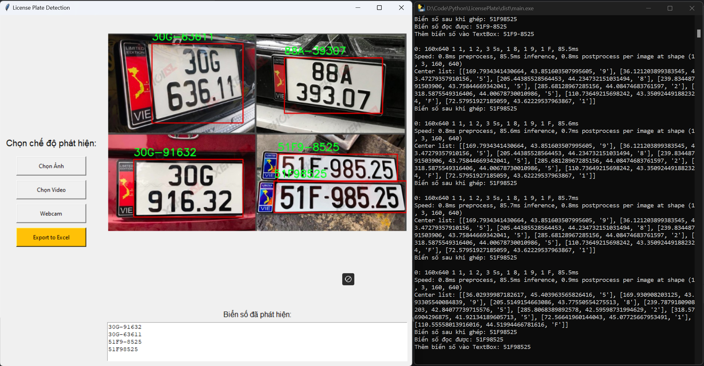
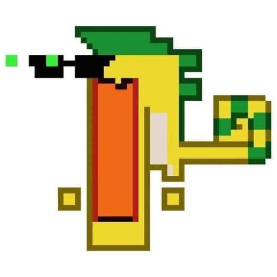

# 🇻🇳 Vietnamese License Plate Recognition with YOLOv8

This project leverages **YOLOv8** and **Python** to detect and recognize Vietnamese license plates from images, videos, or webcam. It includes a full GUI built with Tkinter, and supports exporting results to Excel with annotated images.


## 🧰 Features
***
- License plate detection using YOLOv8
- Character recognition using custom-trained YOLOv8m models
- GUI built with Tkinter
- Supports image, video, and webcam input
- Export results (license plate, timestamp, image) to Excel
- Preprocessing (deskew, contrast enhancement) for better OCR accuracy


## 📦 Installation
***
Clone the repository and install dependencies:

```
# Clone the repository
git clone https://github.com/Newbie1402/License-Plate-detection.git
cd License-Plate-detection
code .
# Install the ultralytics package 
pip install ultralytics
# Install dependencies using pip 
pip install -r ./requirement.txt
 ``` 
## 🚀 Running the Application
***
Navigate to the built executable
```
cd LicensePlate\dist
main.exe
``` 
Run the app with GUI:
```
Run python main.py
``` 

## 🧪 Model Training
***
The project uses a 2-stage pipeline:

Stage 1 – License Plate Detection:

- Model detects license plates in the image.

Stage 2 – Character Recognition:

- Model detects individual characters inside the plate.

## 🏋️ Training YOLOv8m Model
***
```
  cd training
  python train.py
```
&rarr; Make sure to configure train.py with your dataset path and model parameters. 


<div style="text-align: center;">Results are trained from YOLO Detect model.</div>

***


<div style="text-align: center;">Results are trained from YOLO OCR model.</div>

## 🔗 Datasets Used
- **Character Detection:** 
  - [**Vietnamese License Plate Dataset**](https://universe.roboflow.com/cao-phong-3qbun/letter-detection-0f1lb)

- **License Plate Detection:** 
  - [**Vietnamese License Plate Dataset**](https://universe.roboflow.com/test-n0rhd/vietnamese-license-plate-tptd0-npjfu)


# <span style="color: green;"> 📸 Sample Result
***


## <span style="color: red;"> 📢 Warning
***
<div style="background-color: #ffdddd; color: #cc0000; padding: 15px; border: 1px solid #cc0000; border-radius: 5px;">
  ⚠️ **WARNING:** The current system does **not** support the recognition of diplomatic license plates and military vehicle license plates. Please note that accuracy definitely lower for these types of plates.
</div>

## <span style="color: yellow;"> 📁 Project Structure
***
```
├── main.py                  # Entry point for GUI
├── dist/                    # Application.exe
├── function/                # Image processing
├── training/                # Training scripts
├── model/                   # Trained models
├── requirements.txt         # Dependencies
└── README.md
```
## 📝 Update main.spec
***
```
python -m PyInstaller main.spec 
```

## <span style="color: #FF9999;"> 🤝 Contribute
[](https://github.com/Newbie1402/License-Plate-detection/graphs/contributors)
***


<div style="display: flex; flex-wrap: wrap; justify-content: center;">
    <a href="https://github.com/Ho4Vit">
        
    </a>
    <a href="https://github.com/Newbie1402">
        
    </a>
    <a href="https://github.com/JayT02z">
        
    </a>
</div>

<div style="text-align: center;">We look forward to your contributions to help make the project even better!</div>

## 📞 Contact
***
For bug reports and feature requests related to this software, please visit [GitHub Issues](https://github.com/Newbie1402/License-Plate-detection/issues). For questions, discussions, and community support, join our active communities on [Discord](https://discord.gg/3DmcPURR), and the [Zalo Community](https://zalo.me/g/uyzmad500). We're here to help with all things this project!

